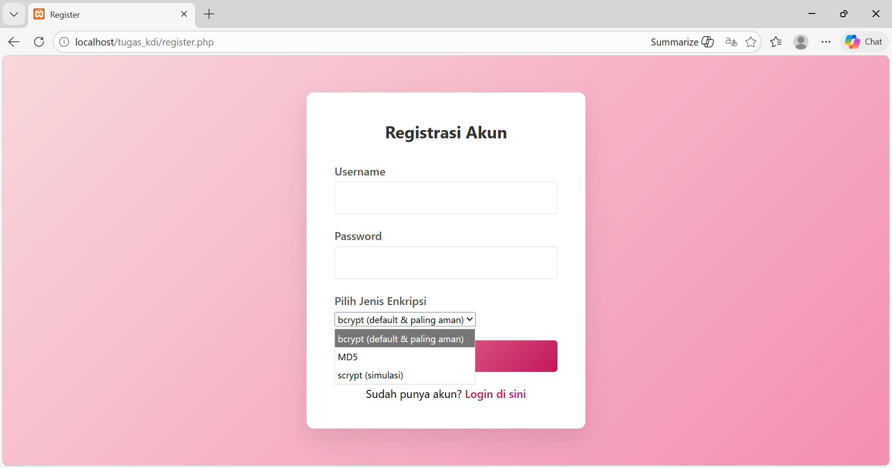
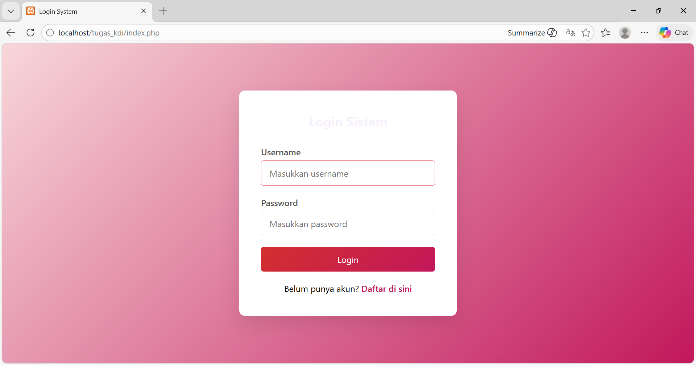
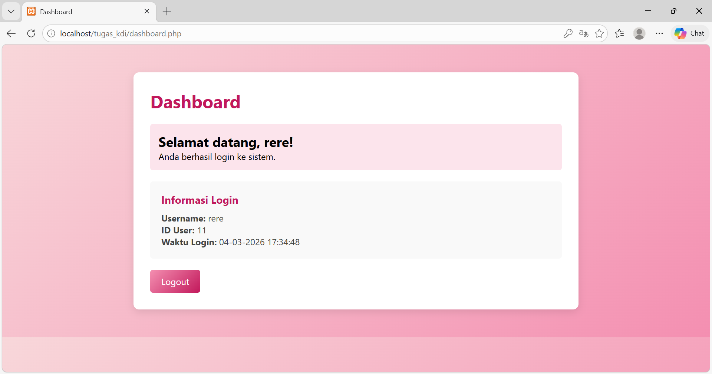

# PHP Authentication System with Password Hashing
Simple authentication system built with PHP & MySQL.
This project demonstrates password hashing implementation using multiple algorithms for learning purposes.

# Features
- User Registration
- Login & Logout
- Session Management
- Protected Dashboard
- Login Information Display (User ID & Login Time)
- Password Hashing Comparison:
  - bcrypt (recommended & default)
  - MD5 (legacy - for learning only)
  - scrypt (simulation)

## Tech Stack
- PHP
- MySQL
- HTML
- CSS
- XAMPP (Local Development)

# Security Notes
- bcrypt is used as the default and recommended hashing algorithm.
- MD5 is included for educational comparison only and **is NOT secure for production use**.
- This project is built for learning authentication concepts and hashing evolution.

# What I Learned
- Password hashing & verification
- Differences between hashing algorithms
- Session handling in PHP
- Basic authentication flow
- Secure login implementation

# How to Run (Local)
1. Clone this repository
2. Move the folder to `htdocs`
3. Import the provided database file into phpMyAdmin
4. Start Apache & MySQL in XAMPP
5. Open `localhost/folder-name` in browser

# Screenshot

# Author
Redita Sulis Cahyati
